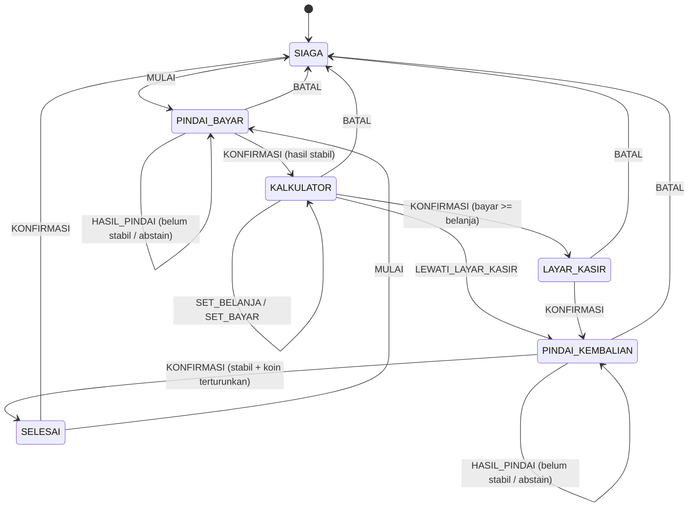

# Arsitektur SUDEPI

Status: **aktif** · Turunan dari Exsum bagian 3.3, dengan penyesuaian di `PERUBAHAN.md`

---

## Bentuk dasar

SUDEPI adalah **aplikasi satu-proses tanpa server**. Tidak ada bagian sistem
yang berada di luar HP pengguna. Ini bukan pilihan performa, tapi pilihan
kepercayaan: riwayat transaksi tunanetra tidak pernah meninggalkan perangkat
karena secara arsitektur memang tidak ada tempat untuk pergi.

```
┌──────────────────────── APK Capacitor ────────────────────────┐
│                                                               │
│  Lapisan native (Kotlin, lewat plugin)                        │
│  ├─ Haptik          ├─ Preferensi         ├─ Siklus hidup     │
│                                                               │
│  ┌────────────────── WebView (Chromium) ──────────────────┐   │
│  │                                                        │   │
│  │  Utas utama                     Web Worker             │   │
│  │  ┌──────────────────┐          ┌───────────────────┐   │   │
│  │  │ ui/   React      │          │ ONNX Runtime Web  │   │   │
│  │  │ core/ reducer    │  bingkai │ WASM + SIMD       │   │   │
│  │  │ audio/ Web Audio │ ───────► │ YOLOv8n int8 320  │   │   │
│  │  │ data/ Dexie      │ ◄─────── │ decode + NMS      │   │   │
│  │  │ vision/ kamera   │  kotak   └───────────────────┘   │   │
│  │  └──────────────────┘                                  │   │
│  │        │                                               │   │
│  │        └─ getUserMedia + Torch API (tanpa plugin)      │   │
│  └────────────────────────────────────────────────────────┘   │
└───────────────────────────────────────────────────────────────┘
                    Tidak ada panah keluar. Sengaja.
```

**Kenapa inferensi ditaruh di Web Worker.** Inferensi memakan ~120 ms. Kalau
dijalankan di utas utama, pratinjau kamera membeku selama itu, tiap bingkai.
Pengguna melihat video patah-patah dan React tidak sempat merespons sentuhan.
Worker membuat utas utama tetap bebas: kamera mengalir mulus, gestur langsung
terasa, dan inferensi berjalan di belakang. Ini juga yang membuat HP RAM 2 GB
tetap terpakai, bukan sekadar optimasi yang enak-enak saja.

## Alur satu bingkai

```
video ──► createImageBitmap(resize 320)
            │   (di GPU, bukan getImageData — 10x lebih cepat)
            ▼
        letterbox ke 320x320 di OffscreenCanvas
            │   (jaga rasio; kalau diregangkan, mAP anjlok)
            ▼
        postMessage(bitmap, [bitmap])   ◄── transferable, nol salinan
            ▼
      ┌─ WORKER ────────────────────────────────┐
      │  normalisasi ke float32 [1,3,320,320]   │
      │  ort.InferenceSession.run()             │
      │  keluaran mentah [1, 12, 2100]          │
      │  decode kotak + skor                    │
      │  saring skor < 0.85                     │
      │  NMS class-agnostic, IoU > 0.40         │
      └─────────────┬───────────────────────────┘
                    ▼
        Deteksi[] kembali ke utas utama
                    ▼
        voting temporal: 3 dari 5 bingkai
                    ▼
                HasilPindai  ──► core/ reducer ──► Efek[] ──► audio, haptik, dll
```

### Kenapa keluaran modelnya `[1, 12, 2100]`

8 kelas + 4 koordinat kotak = 12 kanal. Jumlah jangkar pada `imgsz=320`:
40x40 + 20x20 + 10x10 = 1.600 + 400 + 100 = 2.100. Kalau bentuk keluaran
yang kamu terima berbeda dari ini, berarti ekspornya salah — periksa `imgsz`
dan jumlah kelas sebelum menulis kode decode.

## Model

```bash
# Ekspor. Perhatikan nms=False — lihat ADR-0002.
yolo export model=best.pt format=onnx imgsz=320 opset=12 simplify=True nms=False dynamic=False
```

Lalu kuantisasi ke INT8 dengan kalibrasi statis (bukan dinamis) memakai sekitar
200 citra dari set validasi.

Model memakai **8 kelas**: 7 pecahan kertas ditambah 1 kelas koin. Tahun emisi
tidak dipisahkan — uang TE 2016 dan TE 2022 masuk ke kelas nominal yang sama,
karena tahun emisi tidak pernah diucapkan kepada pengguna. Lihat ADR-0007.

**Gerbang mutu yang wajib dipatuhi:** ukur mAP@0.5 model INT8 terhadap model
FP32 pada set validasi yang sama. **Kalau turun lebih dari 3 poin, buang INT8
dan kirim FP32.** Model FP32 YOLOv8n berukuran sekitar 12 MB — masih sangat
wajar untuk dibundel dalam APK, dan 6 MB tambahan tidak sebanding dengan
akurasi yang hilang saat menyebut nominal uang orang. Angka "~6 MB" di exsum
adalah target, bukan janji yang boleh menggerus akurasi.

Bobot dan checksum-nya dicatat di store `versi_model`, supaya setiap hasil
deteksi bisa ditelusuri ke versi model yang memproduksinya.

## Kamera dan senter

Keduanya dipakai **langsung dari Web API**, tanpa plugin Capacitor:

```ts
// Senter: tidak butuh @capgo/capacitor-flash
const track = stream.getVideoTracks()[0];
await track.applyConstraints({ advanced: [{ torch: true }] });
```

Setiap plugin native adalah satu risiko build Gradle tambahan di tengah lomba.
Kalau Web API sudah cukup, pakai Web API. Kita hanya memakai plugin untuk hal
yang benar-benar tidak ada padanan web-nya: haptik dan preferensi.

**Senter otomatis** dipicu dari nilai `luma` yang sudah dihitung dari bingkai
yang memang sedang diproses. Tidak perlu sensor cahaya terpisah, tidak perlu
izin tambahan, dan gratis secara komputasi.

## Persistensi

Delapan object store sesuai Lampiran 7, nama dipertahankan persis:
`denominasi`, `versi_model`, `pengaturan`, `sesi_transaksi`, `sesi_pemindaian`,
`hasil_deteksi`, `log_kejadian`, `agregat_metrik`.

**Aturan penulisan yang tidak boleh dilanggar.** Pemindaian berjalan 5 sampai
10 bingkai per detik, masing-masing menghasilkan beberapa deteksi. Menulis tiap
deteksi ke IndexedDB saat itu juga berarti ratusan transaksi tulis per menit,
di utas yang sama dengan UI. Pratinjau kamera akan tersendat dan penyebabnya
sulit dilacak.

Karena itu: **kumpulkan di memori, tulis sekali saat fase berakhir.**
Yang disimpan hanyalah deteksi yang ikut menentukan keputusan — himpunan yang
lolos voting, ditambah ringkasan yang ditolak (berapa banyak, karena gating
atau karena IoU). Ini tetap memenuhi kebutuhan jejak audit Abstain Policy dan
`agregat_metrik`, tanpa membanjiri basis data dengan bingkai yang tidak pernah
mempengaruhi apa pun.

Data tidak pernah dikirim ke mana pun, jadi enkripsi *at rest* tidak
menambah perlindungan berarti di sini — IndexedDB sudah berada di dalam sandbox
aplikasi Android. Menambahkannya di 24 jam adalah biaya tanpa hasil.

## Jaminan luring

Ini bukan sifat yang muncul sendiri; ia harus dijaga secara aktif.

- Tidak ada `fetch`, `XMLHttpRequest`, atau URL absolut ke host mana pun di
  kode produksi.
- Tanpa Google Fonts, tanpa CDN, tanpa ikon jarak jauh. Font dibundel sebagai
  aset lokal.
- `.wasm` ORT, bobot ONNX, dan audio sprite semuanya berada di `dist/`.
- `speechSynthesis` hanya cadangan, tidak pernah jalur utama (ADR-0003).
- STT native, kalau dipakai, wajib `requireOnDeviceRecognition: true` (ADR-0005).

**Cara membuktikannya:** nyalakan mode pesawat, matikan Wi-Fi, lalu jalankan
seluruh skenario `docs/DEMO.md`. Tidak ada cara lain yang sahih. Uji ini
dilakukan di jam ke-19, bukan di jam ke-23.

## Mesin state transaksi



Dua sifat dari `SELESAI` yang perlu disebut. Pertama, `KONFIRMASI` di sana
mengembalikan ke Mode Siaga **tanpa** mengucapkan "transaksi dibatalkan" —
transaksinya berhasil, bukan gagal, dan mengucapkan kata yang salah kepada
orang yang hanya punya suara sebagai umpan balik akan membingungkan. Kedua,
`MULAI` langsung membuka transaksi baru, supaya pengguna yang berbelanja di
dua lapak berturut-turut tidak perlu melewati Mode Siaga lebih dulu.

Dua sifat yang harus dijaga, dan keduanya punya tes:

- **`BATAL` sah dari fase mana pun** kecuali `SIAGA`. Pengguna harus selalu
  bisa keluar. Kalau ada satu fase saja yang tidak bisa dibatalkan, itu jebakan
  bagi orang yang tidak bisa melihat di mana dia terjebak.
- **Pembayaran kurang dari belanja ditolak di `KALKULATOR`**, sebelum masuk
  `LAYAR_KASIR`. Menolaknya belakangan berarti pedagang sudah terlanjur melihat
  angka yang salah.

## Presensi koin

Koin tidak pernah dikenali nilainya. Nilainya **diturunkan**:

```
nominalKoin = kembalianWajib - totalUangKertasTerdeteksi
```

Dengan syarat: hasil pindai Fase 4 berstatus `stabil`, dan selisihnya bernilai
positif serta lebih kecil dari 1.000 (pecahan kertas terkecil). Kalau selisih
mencapai 1.000 atau lebih, berarti ada uang kertas yang tidak terdeteksi, bukan
koin — sistem harus abstain dan meminta pindai ulang, bukan menyebutnya koin.

Kekeliruan inilah yang paling mungkin lolos ke demo, jadi ia wajib punya tes
tersendiri di `core/koin.ts`.
